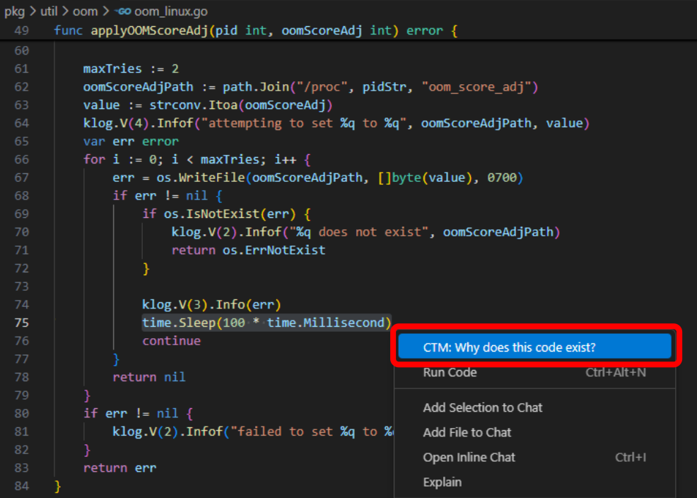
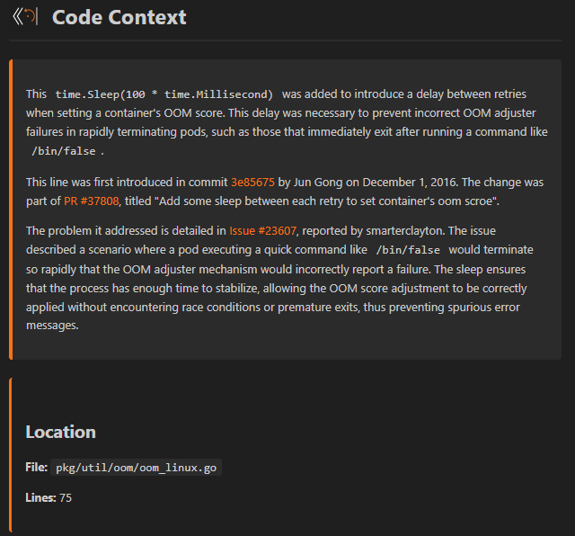
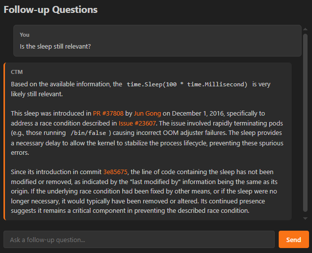

# Codebase Time Machine

[](https://pypi.org/project/codebase-time-machine/)
[](https://marketplace.visualstudio.com/items?itemName=BurakKTopal.codebase-time-machine)
[](https://www.gnu.org/licenses/agpl-3.0)

**Understand why code exists, not just what it does.**

Codebase Time Machine (CTM) answers the question developers ask daily: *"Why does this code exist?"* It traces the decision chain from code to commits, PRs, issues, and discussions.

**What used to take 10-30 minutes of manual git blame → PR → issue searching now takes less than a minute.**

## Why CTM?

Without tools, AI assistants guess about code history based on patterns. Even with web search, general-purpose search engines aren't designed to trace code back to specific commits, PRs, or issues. CTM provides specialized tools for exactly this.

CTM provides 32 tools that let AI agents:
- Search code history - find when and why specific code was introduced (pickaxe search)
- Trace the decision chain - from line → commit → PR → issue → discussion
- Get verified answers - every response links to real commits, PRs, and issues

The result: answers backed by actual sources you can verify.

## Use Cases

**Faster development** - CTM helps AI agents quickly understand any codebase: its structure, patterns, and purpose. Instead of the agent guessing or asking you repeatedly, it can look up how things work and find relevant functions on its own.

**Working with unfamiliar code** - whether you're contributing to open source, onboarding to a new project, or integrating a library, CTM helps you understand the reasoning behind code before you change it.

**Code reviews and debugging** - trace code back to the commit, PR, and issue that introduced it, along with any discussion about why it was done that way.

## Supported Repositories

Works on local git repos, remote GitHub repos (no cloning needed), and private repos (with GitHub token).

## Two Ways to Use CTM

| | MCP Server | VS Code Extension |
|---|---|---|
| **For** | Claude Code, Claude Desktop | VS Code users |
| **Tools** | All 32 investigation tools | 10 curated core tools |
| **Interface** | Chat with AI | Right-click menu + Chat |
| **Setup** | [MCP Server Guide](ctm_mcp_server/README.md) | [Extension Guide](extensions/vscode/README.md) |

## Quick Start

### MCP Server (Claude Code / Claude Desktop)

[](https://youtu.be/-dvF_4N_SOs)

1. Install:
```bash
pip install codebase-time-machine
```

2. Add config:

| Platform | Config Location |
|----------|-----------------|
| Claude Code | `.mcp.json` in your project root |
| Claude Desktop | `~/Library/Application Support/Claude/claude_desktop_config.json` (macOS), `%APPDATA%\Claude\claude_desktop_config.json` (Windows), `~/.config/Claude/claude_desktop_config.json` (Linux) |

Config content:
```json
{
  "mcpServers": {
    "ctm": {
      "command": "python",
      "args": ["-m", "ctm_mcp_server.stdio_server"],
      "env": { "GITHUB_TOKEN": "your_token_here" }
    }
  }
}
```

The `GITHUB_TOKEN` is optional for public repos, but recommended for higher rate limits and required for private repos.

### VS Code Extension

The MCP Server is natively compatible with Claude Code and Claude Desktop. To provide a wider range of use, a VS Code extension is built that makes it possible to use OpenAI, Gemini and Anthropic models too.
1. Install the MCP server (above)
2. Install extension from [VS Code Marketplace](https://marketplace.visualstudio.com/items?itemName=BurakKTopal.codebase-time-machine)
3. Configure API key (Anthropic, OpenAI, or Gemini)
4. Select code, right-click, "CTM: Why does this code exist?"

**Example: Kubernetes OOM Sleep**

There's a mysterious `time.Sleep(100ms)` in Kubernetes' OOM adjuster. Without CTM, you might guess it's for rate limiting. With CTM, you get the real story: it traces back to [commit 3e85675](https://github.com/kubernetes/kubernetes/commit/3e85675), [PR #37808](https://github.com/kubernetes/kubernetes/pull/37808), and [Issue #23607](https://github.com/kubernetes/kubernetes/issues/23607) — a fix for a race condition with rapidly terminating containers like `/bin/false`.

All references are clickable hyperlinks that take you directly to the source.

<table>
  <tr>
    <td align="center" valign="bottom"><br/><em>1. Select code</em></td>
    <td align="center" valign="bottom"><br/><em>2. Get the decision chain</em></td>
  </tr>
  <tr>
    <td colspan="2" align="center"><br/><em>3. Ask follow-up questions</em></td>
  </tr>
</table>

## Links

- [PyPI Package](https://pypi.org/project/codebase-time-machine/)
- [VS Code Extension](https://marketplace.visualstudio.com/items?itemName=BurakKTopal.codebase-time-machine)
- [Demo Video](https://youtu.be/-dvF_4N_SOs)

## Documentation

- [MCP Server](ctm_mcp_server/README.md) - Full tool reference, caching, configuration
- [VS Code Extension](extensions/vscode/README.md) - Setup, architecture, token optimization

## License

Both components are licensed under AGPL-3.0.

| Component | License |
|-----------|---------|
| MCP Server (`ctm_mcp_server/`) | [AGPL-3.0](ctm_mcp_server/LICENSE) |
| VS Code Extension (`extensions/vscode/`) | [AGPL-3.0](extensions/vscode/LICENSE) |

Copyright 2025-2026 Burak Kucuktopal
